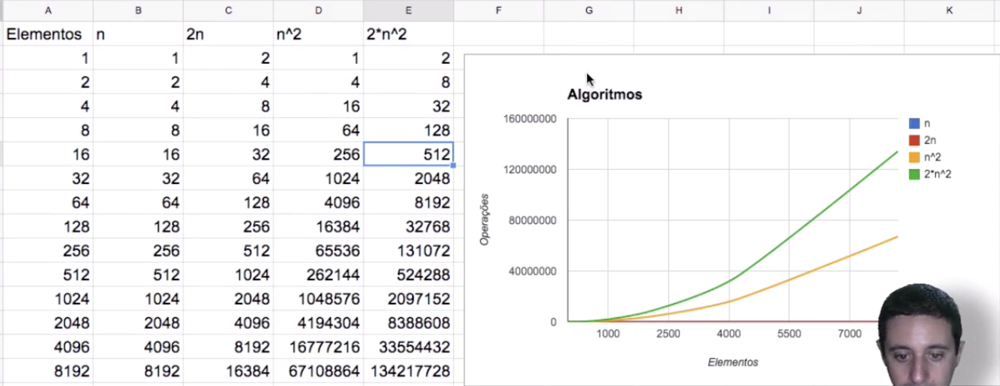

# Algoritmos
Algoritmos Alura, revendo o curso de estrutura de dados, depois que estava fazeendo o curso de Clojure Funcional :) 

## Big Notation (O-Grande)
Image with the Big Notation from Wikipedia:


Select & Insert sort tem uma complexidade computacional de O(n^2) "quadratico". 
Porque eles vão aumentar exponencialmente o numero de compracoes de acordo com a quantidade de dados em um array.
Isso acontece porque eu preciso comparar todos os valores do array com todos os outros, ou seja se eu tenho um array de 10 e eu adiciono mais 1 elemento, eu acrescento mais 10 comparacoes.

O algoritmo para selecionar o menor de uma lista é apenas O(n) ja que aumenta de forma linear. Se eu adiciono um elemento em um array de 10, eu acrescento apenas mais uma operacao.
Uma vez o array ordenado, para selecionar o menor a complexidade é O(1) já que é sempre o mesmo custo, porque já sabemos a posicao do menor.



### Big Notation Logaritmo 
Uma busca linear tem uma complexidade computacional de O(n), ou seja, onde N eh o tamanho do array.
Se eu tiver um array de 10 posicoes eu preciso fazer 10 comparacoes para encontrar a posicao desejada.

Uma busca binaria tem uma complexidade computacional de O(log n) base 2.
Se eu tiver um array de 1024 posicoes, eu preciso fazer apenas 10 comparacoes log(1024, 2).
Se eu tiver um array de 2048 posicoes, eu preciso fazer apenas 11 comparacoes log(2048, 2) e assim por diante.

Porque log(n) base 2?
Porque a cada vez que acrescentamos um novo elemento no array binario, 
ele nao altera a quantidade de comparacoes, 
ele apenas altera quando a gente dobra a quantidade de elementos. Por exemplo:
```
2 elementos = 1 comparacao
3 elementos = 2 comparacoes
4 elementos = 2 comparacoes
5 elementos = 3 comparacoes
6 elementos = 3 comparacoes
7 elementos = 3 comparacoes
8 elementos = 4 comparacoes
9 elementos = 4 comparacoes
...
15 elementos = 4 comparacoes
16 elementos = 4 comparacoes
...
31 elementos = 4 comparacoes
32 elementos = 5 comparacoes
```
Ou seja, o comportamento é: 2^comparacoes=numero de elementos 
Como ja sabemos o numero de elementos e queremos descobrir o numero de comparacoes,
Utilizamos o log(numero de elementos) base 2.


