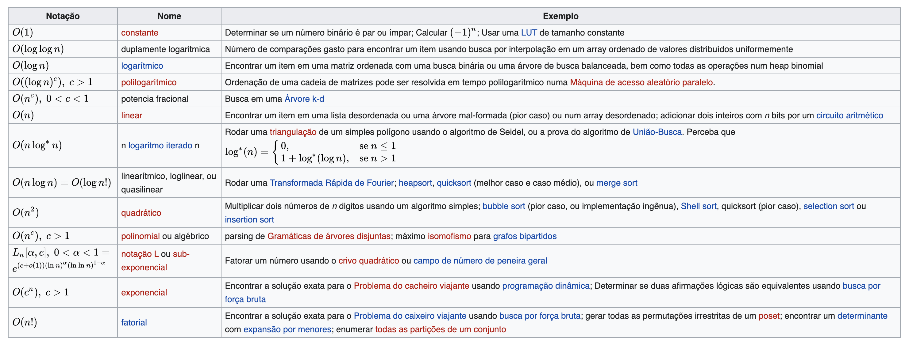

# algoritmos
Algoritmos Alura

## Big Notation (O-Grande)
Image with the Big Notation from Wikipedia:

Select & Insert sort é O(n^2), porque eles vão aumentar exponencialmente o numero de compracoes de acordo com a quantidade de dados.
Já o algoritmo para selecionar o menor é apenas O(n) ja que aumenta de forma linear.
Uma vez o array ordenado, para selecionar o menor a complexidade é O(1) já que é sempre o mesmo custo, porque já sabemos a posicao do menor.

